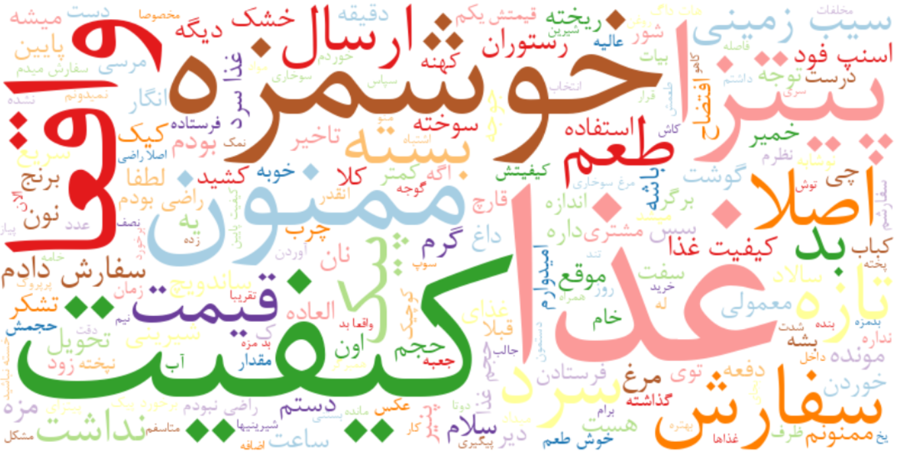
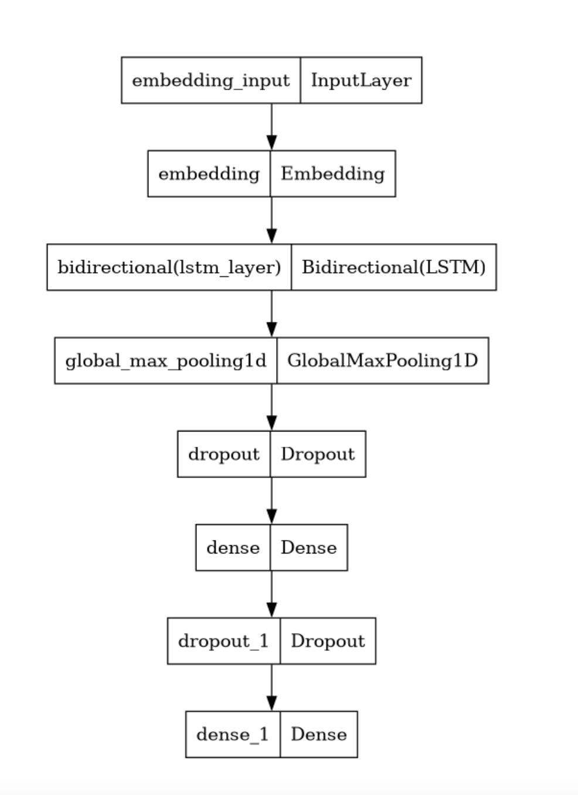
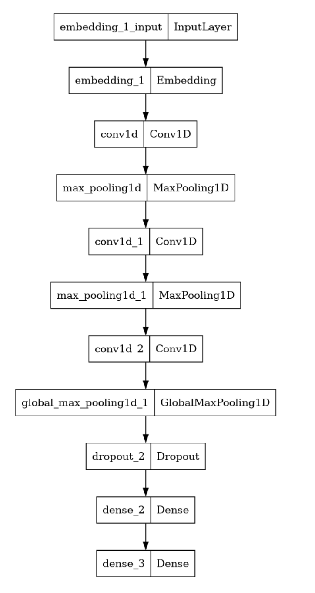
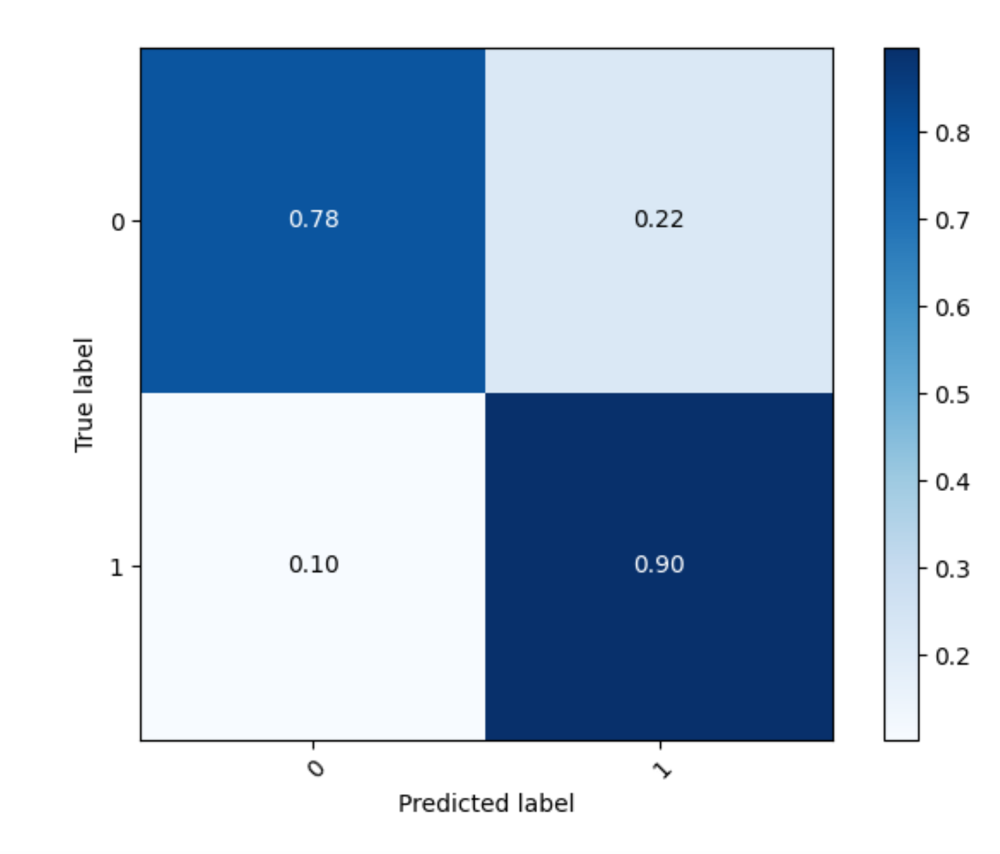
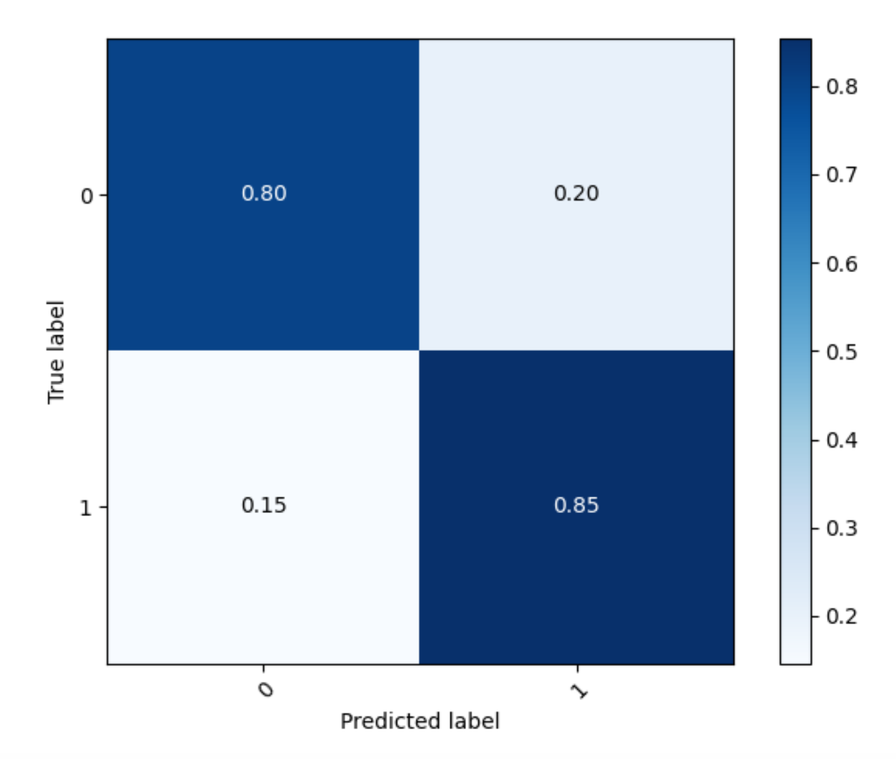

# Persian Sentiment Analysis

## Overview
This project focuses on **Persian sentiment analysis** for marketing applications using user reviews from **SnappFood**, a major online food delivery platform in Iran. The goal is to classify sentiment as **positive (happy) or negative (sad)** using advanced **natural language processing (NLP) techniques** and deep learning models.

### Word Cloud Visualization
<p align="center">
  
</p>

## Team Members
- **Mobin Nesari**
- **Parmida Jabari**

### Supervisors:
- **Hadi Farahani**
- **Shide Sharif**
- **Niloofar Shabani**

## Dataset
### Description
The dataset consists of user-submitted reviews in **Persian**, labeled as either **HAPPY** or **SAD**. The dataset includes three main columns:
- `comment`: The full text of the review in Persian.
- `label`: Sentiment category (**HAPPY** or **SAD**).
- `label_id`: Numeric representation of sentiment (1 = Happy, 0 = Sad).

### Data Preprocessing
- Removed non-alphanumeric characters and punctuation.
- Tokenized text using **NLTK**.
- Applied **Hazm stop-word removal** for Persian text.
- Utilized **pre-trained FastText word embeddings**.
- Ensured a **balanced 50-50 sentiment distribution** across training and testing sets.

## Model Architecture
The project employs **two deep learning models**:

### 1. Bidirectional Long Short-Term Memory (BiLSTM)
- Uses **pre-trained FastText embeddings**.
- A **Bidirectional LSTM layer** captures both past and future context.
- **Global max pooling** extracts key features.
- **Dense layers with dropout** prevent overfitting.
- **Final sigmoid activation** for binary sentiment classification.

<p align="center">
  
</p>
<p align="center"><em>Figure 1: Model Summary for BiLSTM Architecture</em></p>

### 2. Convolutional Neural Network (CNN)
- Uses **pre-trained FastText embeddings**.
- **Multiple convolutional layers** capture different text features.
- **Max pooling layers** reduce dimensionality.
- **Dense layers with dropout** enhance generalization.
- **Final sigmoid activation** outputs sentiment probabilities.

<p align="center">
  
</p>
<p align="center"><em>Figure 2: Model Summary for CNN Architecture</em></p>

## Results & Evaluation
- **BiLSTM model:** 83.99% accuracy, Weighted F1-score = **0.84**.
- **CNN model:** 82.69% accuracy, Weighted F1-score = **0.83**.
- **Confusion matrices** highlight model performance in sentiment classification.

### Confusion Matrices for Model Performance
<p align="center">
  
  
</p>
<p align="center"><em>Figure 3: Confusion Matrix for BiLSTM (Left) and CNN (Right)</em></p>

## Future Work
- Implementing **intent classification** for chatbot applications.
- Expanding analysis to datasets from **Digikala, Tapsi, and Sibche**.
- Exploring **transformer-based models** like **BERT** for Persian sentiment analysis.

## Accessing the Code
Find the full implementation in the repository:
[Persian Sentiment Analysis GitHub Repo](https://github.com/Parmidajabbari/Persian-Sentiment-Analysis)

## Dependencies
To run the project, install the required dependencies:
```sh
pip install hazm keras transformers torch numpy pandas scikit-learn matplotlib
```

## License
This project is licensed under the MIT License.
